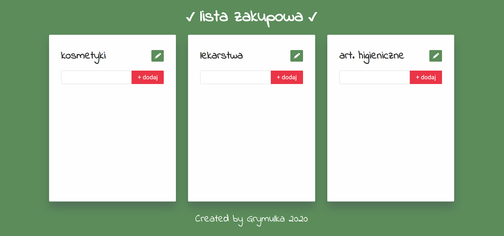
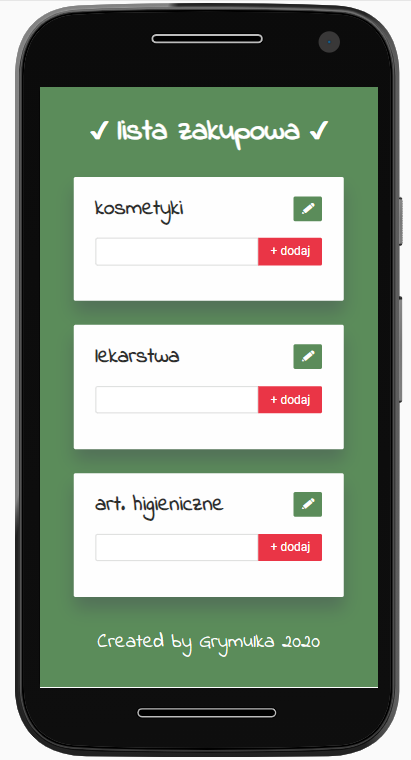

**If you want to try it out, click here: [Shopping List](https://ulakrawczyk.github.io/shopping-list/)**

### This is a PWA APP letting you to remember what to buy next

### To create it, i use:

- html5, css 3 and sass
- css3 with grid and flexbox layout
- js with localstorage
- rwd

## Page is based on WTF Webpack Starter Kit

## Available scripts

`npm run start` - runs development mode

`npm run build` - runs build process for production

`npm run publish` - runs build process and publish the page using `gh-pages` branch
